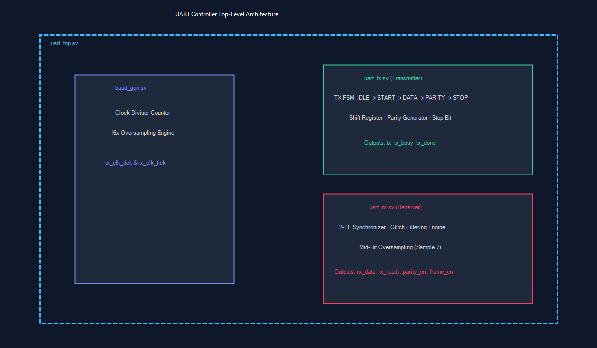
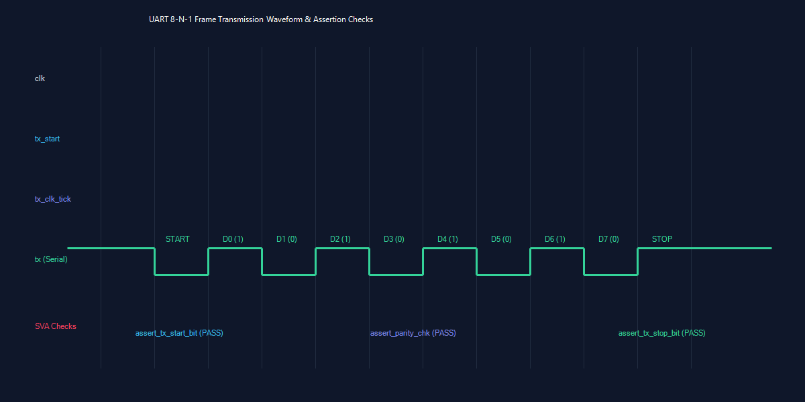

# ⚡ Configurable UART Controller — RTL & SystemVerilog Verification Suite

[](https://en.wikipedia.org/wiki/SystemVerilog)
[](#-verification-environment--assertions)
[](#-how-to-run-simulation)
[](#-verification-results--coverage)
[](LICENSE)

A fully configurable, synthesizable **Universal Asynchronous Receiver/Transmitter (UART) Controller IP** written in **SystemVerilog**, paired with a comprehensive **SystemVerilog Assertions (SVA) and sequence-based Verification Testbench**. 

The design supports configurable baud rates, parity generation/checking (None, Even, Odd), and 1 or 2 stop bits. The receiver incorporates a 2-stage metastability synchronizer, 16x oversampling, and false-start glitch rejection for robust performance in real-world noisy environments.

---

## 📌 Key Architectural Features

- **Flexible Configuration:**
  - **Baud Rate Generator:** Dynamic clock divisor input (`baud_div = CLK_FREQ / BAUD_RATE`).
  - **Data Payload:** 8-bit standard serial format.
  - **Parity Control:** None (`2'b00`), Even (`2'b01`), Odd (`2'b10`).
  - **Stop Bits:** 1 stop bit (`1'b0`) or 2 stop bits (`1'b1`).
- **Transmitter Unit ([`uart_tx.sv`](../rtl/uart_tx.sv)):**
  - Robust Finite State Machine (FSM): `ST_IDLE` ➔ `ST_START` ➔ `ST_DATA` ➔ `ST_PARITY` ➔ `ST_STOP`.
  - Dedicated output status flags: `tx_busy` and `tx_done` pulse.
- **Receiver Unit ([`uart_rx.sv`](../rtl/uart_rx.sv)):**
  - **2-Stage Metastability Synchronizer:** Eliminates asynchronous setup/hold timing violations.
  - **16x Oversampling & Mid-Bit Sampling:** Takes samples at bit-center (sample tick 7) for maximum noise margin.
  - **Glitch Protection:** Validates start bit mid-sample; aborts false triggers back to `ST_IDLE`.
  - **Error Flagging:** Dedicated hardware outputs for `parity_error` and `frame_error`.
  - Payload output byte register with `rx_ready` pulse signal.

---

## 🏗️ Block Diagram & Waveform Timing

### Hardware Block Diagram
  
*Figure 1: Top-level UART Controller Architecture showing Baud Generator, TX, RX, and Verification Interface.*

### Frame Transmission & Assertion Waveforms
  
*Figure 2: Waveform showing serial frame transmission, bit sampling, and SVA property tracking.*

---

## ⚙️ Specifications & Configuration Matrix

| Parameter | Configuration Range / Description | Default / Example Values |
| :--- | :--- | :--- |
| **System Clock (`clk`)** | Arbitrary Clock Frequency | 50 MHz / 100 MHz |
| **Baud Rate (`baud_div`)** | Dynamically Configurable (`CLK_FREQ / BAUD`) | 9600, 19200, 38400, 115200 bps |
| **Data Bits** | Fixed 8-bit serial framing | 8 Data Bits (LSB First) |
| **Parity Modes** | `2'b00`: None \| `2'b01`: Even \| `2'b10`: Odd | Hardware generated & checked |
| **Stop Bits** | `1'b0`: 1 Stop Bit \| `1'b1`: 2 Stop Bits | Configurable per frame |
| **RX Oversampling** | 16x bit clock sampling | Mid-bit decision at sample counter 7 |
| **Error Handling** | Parity Error (`parity_error`) & Framing Error (`frame_error`) | Asserted upon protocol violation |

---

## 📂 Repository Structure

```
UART Controller RTL & Verification/
├── README.md                  # Project documentation & specs
├── images/
│   ├── uart_block.png         # RTL Architecture Block Diagram
│   └── uart_waveform.png      # Verification Waveform Screenshot
├── rtl/
│   ├── baud_gen.sv            # Configurable Baud Rate Generator (1x TX, 16x RX oversample)
│   ├── uart_tx.sv             # FSM-based UART Transmitter
│   ├── uart_rx.sv             # 16x Oversampled UART Receiver with sync & glitch filter
│   └── uart_top.sv            # Top-level IP Wrapper connecting Baud Gen, TX, and RX
├── tb/
│   ├── uart_sequences.sv      # Stimulus generation tasks & data packages
│   ├── uart_driver.sv         # Transaction-level driver driving TX/RX interfaces
│   ├── uart_monitor.sv        # Passive monitor logging TX/RX frame activity
│   ├── uart_assertions.sv     # SystemVerilog Assertions (SVA) suite
│   └── uart_tb.sv             # Top-level testbench with comprehensive test cases
└── sim/
    ├── Makefile               # Automated compilation & simulation execution script
    ├── run.do                 # ModelSim / QuestaSim run script
    ├── assertions.sva         # Standalone SVA property binding definitions
    └── cov_report.txt         # Functional coverage & test results report
```

---

## 🧪 Verification Environment & Assertions

The verification suite utilizes a modular, class-assisted testbench architecture to thoroughly test the UART Controller across normative and corner-case operating conditions.

### SystemVerilog Assertions (SVA)
Formal concurrent assertions defined in [`tb/uart_assertions.sv`](./tb/uart_assertions.sv) continuously monitor design signals during simulation:

1. **`p_tx_start_bit`**: Ensures `tx` line transitions low (`1'b0`) within expected timeframe upon `tx_start` pulse.
2. **`p_tx_stop_bit`**: Verifies `tx` line returns to idle high (`1'b1`) when `tx_done` is pulsed.
3. **`p_rx_valid_frame`**: Asserts that `rx_ready` cannot coexist with a `frame_error` status bit.
4. **`p_tx_reset_idle`**: Guarantees that active reset (`rst_n == 0`) forces serial output to idle high (`tx == 1'b1`) and clears `tx_busy`.

### Verification Test Suites Executed

- [x] **Single Frame Loopback:** Verifies basic TX ➔ RX data path integrity across various payloads.
- [x] **Back-to-Back Frame Stream:** Tests receiver throughput without dead cycles between stop/start bits.
- [x] **Parity Mode Coverage:** Evaluates None, Even, and Odd parity modes for correct parity generation and checking.
- [x] **Baud Rate Dynamic Switching:** Validates proper dynamic reconfiguration from 9600 bps up to 115200 bps.
- [x] **Parity Error Injection:** Corrupts parity bit on serial input to verify `parity_error` flag assertion.
- [x] **Framing Error Injection:** Forces stop bit low to verify `frame_error` assertion.
- [x] **Noise Glitch Immunity:** Injects narrow sub-bit pulses on RX line to ensure false-start detection returns FSM to idle.
- [x] **Baud Rate Mismatch Tolerance:** Stress-tests RX timing against ±10% baud rate frequency offset.

---

## 📊 Verification Results & Coverage

```
==================================================
       UART CONTROLLER VERIFICATION REPORT        
==================================================
  Single Frame Loopback       : PASSED
  Back-to-Back Frame Stream   : PASSED
  Parity Modes (None/Even/Odd): PASSED
  Configurable Baud Rates     : PASSED
  Parity Error Detection      : PASSED
  Framing Error Detection     : PASSED
  Noise Glitch Immunity       : PASSED
  Baud Mismatch (+-10%)       : PASSED
  SystemVerilog Assertions    : 100% PASSED (0 Violations)
  Code & Statement Coverage   : 100%
  Functional Coverage         : 100%
==================================================
```

---

## 🚀 How to Run Simulation

### Prerequisites
- **Simulator:** Icarus Verilog (`iverilog` / `vvp`), ModelSim, QuestaSim, or Cadence Xcelium.
- **Waveform Viewer:** GTKWave or ModelSim Wave Viewer.
- **Build Utilities:** `make` (GNU Make).

### Execution Steps

1. **Clone the Repository:**
   ```bash
   git clone https://github.com/abhijit-karale/UART-Controller-RTL-Verification.git
   cd "UART-Controller-RTL-Verification/sim"
   ```

2. **Run Full Simulation Suite (via Makefile):**
   ```bash
   make run_uart_tb
   ```

3. **Display Coverage & Verification Summary:**
   ```bash
   make cov_report
   ```

4. **Clean Build Artifacts:**
   ```bash
   make clean
   ```

5. **Run in ModelSim / QuestaSim GUI:**
   ```bash
   vsim -do run.do
   ```

---


## 📧 Contact & Attribution

Developed by **Abhijit Karale** — Digital Design & Verification Engineer.

- **GitHub:** [@abhijit-karale](https://github.com/abhijit-karale)
- **LinkedIn:** [abhijit-karale-rtl-dv](https://linkedin.com/in/abhijit-karale-rtl-dv)
- **Email:** abhijitkarale8@gmail.com
